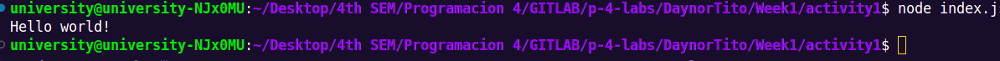

# Activity 1 Lab 1 Node.js and npm Installation Guide

Install Node.js and npm on the system. It also verifying the installation and using a version manager like `nvm` to manage multiple versions of Node.js and npm.

## Step 1: Install Node.js and npm

Follow the instructions on the official [Node.js website](https://nodejs.org/en/download/package-manager) to download and install Node.js and npm. Select the appropriate installer for the operating system (Windows, macOS, or Linux).

### Using nvm (Node Version Manager)

Using a version manager like `nvm` is recommended to easily switch between different versions of Node.js and npm.

#### Installation of nvm

1. Open the terminal.
2. Run the following command to install `nvm`:
    ```sh
    curl -o- https://raw.githubusercontent.com/nvm-sh/nvm/v0.39.3/install.sh | bash
    ```
3. After the installation, run the following command to install:
    ```sh
    nvm install 20
    ```
 
4. Verify that the installation was correct:
    ```sh
    node -v
    ```

5. Verifies the right NPM version is in the environment
    ```sh
    npm -v
    ```

### Verify the Installation

To ensure that Node.js and npm are installed correctly, run the following commands:

```sh
node -v
npm -v
```

Must print the of node and npm versions.

# Installation of Visual Studio Code (VS Code) on Linux

Install Visual Studio Code (VS Code) on a Linux system and how to install the necessary extensions for enhanced development.

## Step 1: Download and Install Visual Studio Code

Follow the official instructions on the [Visual Studio Code website](https://code.visualstudio.com) to download and install VS Code for Linux.

1. **Download the VS Code package** for your specific Linux distribution from the [official download page](https://code.visualstudio.com/download).
2. **Install the downloaded package**:
    - For Debian-based distributions like Ubuntu, use:
      ```sh
      sudo apt install ./<file>.deb
      ```

## Step 2: Install Extensions from the VS Code Marketplace

Install the following extensions from the VS Code Marketplace:

### ESLint

1. Open VS Code.
2. Go to the Extensions view by clicking on the Extensions icon in the Activity Bar on the side of the window or by pressing `Ctrl+Shift+X`.
3. Search for "ESLint".
4. Click "Install" to install the ESLint extension.

### Prettier - Code formatter

1. In the Extensions view, search for "Prettier - Code formatter".
2. Click "Install" to install the Prettier extension.

## Additional Steps

After installing these extensions, you might need to configure them according to your project's requirements. For example, you can create a `.eslintrc` configuration file for ESLint and a `.prettierrc` configuration file for Prettier in your project's root directory.

### Verify Installation

To ensure that VS Code and the extensions are installed correctly:
1. Open a project folder in VS Code.
2. Open a JavaScript or TypeScript file.
3. You should see linting issues highlighted by ESLint, and you can format your code using Prettier by right-clicking and selecting "Format Document" or by pressing `Shift+Alt+F`.

# Creating a Node.js Project

Create a Node.js project using Visual Studio Code (VS Code) and documents best practices for Node.js project setup.

## Step 1: Open VS Code and Create a New Folder

1. Open Visual Studio Code.
2. Create a new folder for your project:
    - Click on `File` -> `Open Folder...`
    - Select the location where you want to create the project and create a new folder (e.g., `activity1`).

## Step 2: Initialize the Node.js Project

1. Open a terminal in VS Code:
    - Open Terminal.
2. Navigate to the project folder in the terminal (if not already there):
    ```sh
    cd DaynorTito/week1/activity1
    ```
3. Run the following command to create a new Node.js project and generate a `package.json` file:
    ```sh
    npm init
    ```
4. Follow the prompts to enter the details of your project (name, version, description, entry point, etc.). You can accept the defaults by pressing `Enter` or customize as needed.


### Use a .gitignore File

Create a `.gitignore` file in your project root to exclude files and directories that should not be committed to version control. For example:
```sh
# .gitignore
node_modules/
.env
```

# Creating and Running a "Hello World" Script

Create a simple "Hello World" script in Node.js and execute it using the terminal in Visual Studio Code (VS Code).

## Step 1: Create the "Hello World" Script

1. Open Visual Studio Code.
2. In the project folder, create a new file named `index.js`created in the inizialization the Node.js Project
3. Open `index.js` and write the following code to print "Hello World" to the console:
    ```javascript
    console.log("Hello World");
    ```
4. Save the file by pressing `Ctrl+S`.

## Step 2: Execute the Script

1. Open the terminal integrated in VS Code:
    - Click on `Terminal` -> `New Terminal`.
2. Navigate to the project folder in the terminal (if not already there):
    ```sh
    cd DaynorTito/week1/activity1
    ```
3. Run the script using Node.js:
    ```sh
    node index.js
    ```
4. Verify that the message "Hello World" is printed in the terminal, like following image:



