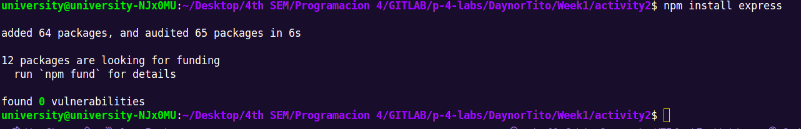

# Project Setup

Follow these steps to set up your Node.js project with Express.js.

## Step 1: Create a New Project Folder

1. Open Visual Studio Code.
2. Create a new folder for your project:

- Click on `File` -> `Open Folder...`
- Select the location where you want to create the project and create a new folder (e.g., `my-express-project`).

## Step 2: Initialize a Node.js Project

1. Open a terminal in VS Code:
    - Click on `Terminal` -> `New Terminal`.
2. Navigate to the project folder in the terminal:
    ```sh
    cd DaynorTito/week1/activity2
    ```
3. Initialize a new Node.js project with a default `package.json` file:
    ```sh
    npm init
    ```

## Step 3: Install Express.js

1. Install Express.js by running the following command in the terminal:
    ```sh
    npm install express
    ```


## Project Structure

The project tructure for a Node.js application using Express, including routes, middlewares, and controllers. Additionally, it provides the rationale behind the chosen structure.

## Step 1: Create the Project Structure

1. Open Visual Studio Code and navigate to your project folder.

2. Create the following folders and files to organize the project:

# Organize

activity2/
├── node_modules/ 
├── src/
│   ├── controllers/
│   │   └── userController.js
│   ├── middlewares/
│   │   └── authMiddleware.js
│   ├── routes/
│   │   └── userRoutes.js
│   ├── app.js
│   └── server.js
├── .gitignore
├── package.json
└── README.md
### Folder and File Descriptions

- `node_modules/`: Contains all the installed dependencies.
- `src/`: Main source folder containing the application's code.
  - `controllers/`: Contains controller files, each responsible for handling logic for specific routes.
  - `middlewares/`: Contains middleware files for handling tasks such as authentication, logging, etc.
  - `routes/`: Contains route files where endpoints are defined.
  - `index.js`: Sets up and configures the Express application.
  - `server.js`: Starts the server and listens on a specified port.
- `.gitignore`: Specifies files and directories to be ignored by git.
- `package.json`: Contains project metadata and dependencies.
- `README.md`: Provides information about the project.

## Rationale for the Project Structure
### Separation of Concerns:
By separating controllers, middlewares, and routes into distinct folders, we maintain a clear separation of concerns. Each file and folder has a specific responsibility, making the code easier to manage and understand.

### Scalability:
As the project grows, new routes, controllers, and middlewares can be added without cluttering the existing structure. This modular approach makes it easier to scale the application.

### Maintainability:
Having a well-organized structure makes it easier to maintain the code. Developers can quickly locate and update the relevant files, reducing the risk of introducing bugs.


# User API Setup Guide

Steps to set up an Express server for a User API, including best practices for configuring the server, defining routes, controllers, and middlewares, and verifying that the server is running correctly.

## Step 1: Server Configuration

### Configure the Express Server

1. Create a file named `server.js` in the `src` folder:
    ```sh
    touch src/server.js
    ```

2. In `server.js`, set up the Express server:
    ```javascript
    const express = require('express');
    const app = express();
    const PORT = process.env.PORT || 3000;

    // Middleware to parse JSON bodies
    app.use(express.json());

    const authMiddleware = require('./middlewares/middleware');
    app.use(authMiddleware);

    // Import and use routes
    const userRoutes = require('./routes/userRoutes');
    app.use('/api/v1', userRoutes);

    app.listen(PORT, () => {
    console.log(`Server is running on port ${PORT}`);
    });
    ```

### Best Practices for Server Configuration

- **Body Parsing Middleware**: Include middleware to parse incoming request bodies as JSON.
- **Modular Routes**: Import and use routes from separate modules for better organization.

## Step 2: Define Routes

### Create a GET Route

1. Create a file named `userRoutes.js` in the `src/routes` folder:
    ```sh
    touch src/routes/userRoutes.js
    ```

2. In `userRoutes.js`, define the GET route:
    ```javascript
    const express = require('express');
    const router = express.Router();
    const userController = require('../controllers/userController');

    // Define a GET route to get all users
    router.get('/user', userController.getAllUsers);

    module.exports = router;
    ```

### Best Practices for Routes

- **RESTful Design**: Follow RESTful conventions for route design, making routes intuitive and predictable.
- **Modularization**: Separate routes into different files based on resource types for better maintainability.
- **Versioning**: Consider versioning your API (e.g., `/api/v1/users`) to manage changes over time.

## Step 3: Define Controllers

### Create a Controller for the GET Route

1. Create a file named `userController.js` in the `src/controllers` folder:
    ```sh
    touch src/controllers/userController.js
    ```

2. In `userController.js`, define the controller function (we have an array of users in userController named users):
    ```javascript
    // Controller to handle GET requests for all users
    exports.getAllUsers = (req, res) => {
    res.json(users);
    };
    ```

### Best Practices for Controllers

- **Separation of Concerns**: Keep business logic in controllers separate from route definitions.
- **Reusability**: Structure controllers to make individual functions reusable across different routes.
- **Error Handling**: Implement error handling within controllers to manage runtime errors gracefully.

## Step 4: Create Middleware

### Create a Middleware to Log Requests

1. Create a file named `middleware.js` in the `src/middlewares` folder:
    ```sh
    touch src/middlewares/middleware.js
    ```

2. In `middleware.js`, define the middleware function:
    ```javascript
    // Middleware to log incoming requests
    module.exports = (req, res, next) => {
    console.log(`${req.method} request to ${req.url}`);
    next();
    };
    ```

3. Add the middleware to the server setup in `server.js`:
    ```javascript
    const authMiddleware = require('./middlewares/middleware');
    app.use(authMiddleware);
    ```

### Best Practices for Middlewares

- **Single Responsibility**: Each middleware should handle a single concern, such as logging, authentication, or error handling.
- **Modularity**: Keep middleware functions in separate files and import them as needed to maintain clean and organized code.

## Step 5: Run the Server

1. Start the server by running the following command in the terminal:
    ```sh
    node src/server.js
    ```

2. Open a web browser and navigate to [http://localhost:3000/users](http://localhost:3000/users) to verify that the server is running and the GET route is accessible.

3. GET requests can be made to get all users:
    ```sh
    /api/v1/user
    ```
3. GET requests can be made to get a specific user by ID::
    ```sh
    /api/v1/user/{id}
    ```